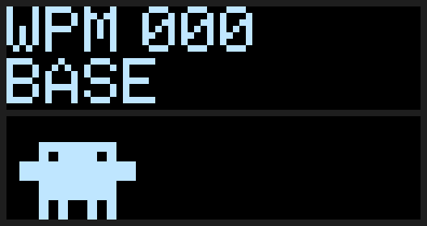

# qmk-vial

Personal QMK/VIAL firmware configurations for my mechanical keyboards.

All keymaps are compatible with **[vial.rocks](https://vial.rocks)** — live keymap editing directly in the browser, no software install required.

## Keyboards

| Folder | Keyboard | Controller | Notes |
|--------|----------|------------|-------|
| [`cornev4/`](cornev4/) | Corne v4.1 (foostan) | RP2040 | Anti-EMI + VIAL + 6 layers |
| [`lily58pro/`](lily58pro/) | Lily58 Pro R2G | RP2040 | VIAL + 40+ RGB animations + custom OLEDs |

---

## Lily58 OLEDs

[`lily58pro/oled.c`](lily58pro/oled.c), 128×32 per half. Previews are rendered by running the firmware's `oled.c` in a PC simulator (top: left/master, bottom: right/slave).

| v1 — 1× text, layer chips | v2 — 2× text, active layer only |
|:-:|:-:|
|  |  |

- **Left:** WPM, WPM history graph, active layer, Caps Lock.
- **Right:** Clawd. Types on a laptop while WPM > 0 (`SPLIT_WPM_ENABLE`), wanders when idle, sleeps after 15 s without input.
- **Burn-in protection:**
  - Contrast `OLED_BRIGHTNESS 24`, `OLED_PRE_CHARGE_PERIOD 0x22`, `OLED_VCOM_DETECT 0x00` ([`config.h`](lily58pro/config.h)).
  - Left screen drifts 1–2 px every 5 min (6 positions).
  - Both screens off after 60 s idle (`OLED_TIMEOUT`, synced via `SPLIT_ACTIVITY_ENABLE`).

Builds per version (`.uf2` + preview): [`lily58pro/firmware/`](lily58pro/firmware/).

---

## Build

### GitHub Actions

No local toolchain or `vial-qmk` clone required. [`.github/workflows/build.yml`](.github/workflows/build.yml) builds both keyboards inside the `ghcr.io/qmk/qmk_cli` container against `vial-kb/vial-qmk@vial`.

| Trigger | Output |
|---------|--------|
| Push to `main`, PR, manual (`workflow_dispatch`) | `.uf2` per keyboard as workflow artifacts (Actions → run → *Artifacts*) |
| Tag `v*` (e.g. `git tag v1.0 && git push --tags`) | GitHub Release with both `.uf2` attached |

To build from a fork: fork the repo, edit the keymap, push — or run it manually from the *Actions* tab.

### Local build

#### 1. Install QMK CLI

```bash
python3 -m pip install --user qmk
```

#### 2. Clone vial-qmk (VIAL fork of QMK)

```bash
git clone https://github.com/vial-kb/vial-qmk.git ~/qmk_firmware
cd ~/qmk_firmware
git submodule update --init --recursive
qmk config user.qmk_home=~/qmk_firmware
```

#### 3. Clone this repo and copy the keymaps

```bash
git clone git@github.com:ericklv/qmk-vial.git ~/qmk-vial

# Corne v4.1
mkdir -p ~/qmk_firmware/keyboards/crkbd/keymaps/cornev4
cp -r ~/qmk-vial/cornev4/* ~/qmk_firmware/keyboards/crkbd/keymaps/cornev4/

# Lily58 Pro R2G
mkdir -p ~/qmk_firmware/keyboards/lily58/keymaps/lily58pro
cp -r ~/qmk-vial/lily58pro/* ~/qmk_firmware/keyboards/lily58/keymaps/lily58pro/
```

#### 4. Compile

##### Corne v4.1

```bash
cd ~/qmk_firmware
qmk compile -kb crkbd/rev4_1/standard -km cornev4
# Output: crkbd_rev4_1_standard_cornev4.uf2
```

##### Lily58 Pro R2G

```bash
cd ~/qmk_firmware
qmk compile -kb lily58/r2g -km lily58pro -e CONVERT_TO=promicro_rp2040
# Output: lily58_r2g_lily58pro_promicro_rp2040.uf2
```

---

## Flash UF2 (RP2040 — both keyboards)

1. Double-click the **RESET** button on the keyboard half
2. A USB drive named **`RPI-RP2`** will appear
3. Drag the `.uf2` file onto the drive — it flashes and reboots automatically
4. Repeat for the **other half**

> Lily58 builds are versioned in [`lily58pro/firmware/`](lily58pro/firmware/) (`.uf2` + OLED preview per version). The Corne `.uf2` is outdated; use GitHub Actions artifacts or releases.

---

## Live Configuration with vial.rocks

1. Open **[vial.rocks](https://vial.rocks)** in **Chrome or Edge**
2. Click **"Connect"** — the browser shows a native WebHID device picker
3. Select your keyboard from the list
4. To unlock key remapping, hold the unlock combo (see each keyboard's `README.md`)

---

## Corne v4.1 — Layer Summary

| Layer | Description |
|-------|-------------|
| 0 | QWERTY base |
| 1 | Numbers + navigation (hold MO1) |
| 2 | F-keys + VIM nav (hold MO2) |
| 3 | RGB control + QK_BOOT (toggle from L2) |
| 4–5 | Free / transparent |

Full diagrams for layers 0–2: [`cornev4/corne_layout.md`](cornev4/corne_layout.md).
