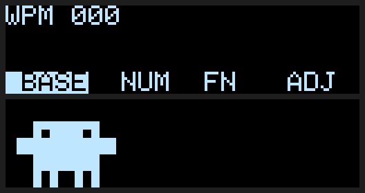

# Lily58 Pro R2G — `lily58pro` Keymap (VIAL + RGB Matrix)

Custom keymap for the **Lily58 Pro R2G** with **RP2040** controller (ProMicro RP2040 conversion).

Full [vial.rocks](https://vial.rocks) browser support with 40+ RGB Matrix animations.

---

## Features

- **VIAL** — live keymap editing from [vial.rocks](https://vial.rocks), no software install needed
- **VialRGB** — full RGB Matrix animation library accessible from the browser
- **OLED** ([`oled.c`](oled.c)) — left: WPM + history graph, Caps Lock, active layer. Right: Clawd (Claude Code mascot) types on a laptop while you type, wanders when idle, sleeps after 15 s

  
- **Manufacturer label**: `FOSS Keyboard` (shown in the About section of VIAL)

---

## Flashing the firmware (.uf2)

The Lily58 Pro R2G has a **physical RESET button** on each half's PCB.

### Steps

1. **Double-click** the RESET button on the half you want to flash
2. The drive `RPI-RP2` will appear on your file manager
3. Drag the `.uf2` file onto the drive — it flashes and reboots automatically
4. Repeat for the **other half**

> Flash each half **separately** with the same `.uf2` file.

---

## Configure with vial.rocks (no compile needed)

1. Open **[vial.rocks](https://vial.rocks)** in Chrome or Edge
2. Click **"Connect"** — your browser shows a native WebHID device picker
3. Select your Lily58 from the list
4. Keymap editing and RGB controls are available immediately in the browser

---

## Build from source

### Prerequisites

```bash
# Install QMK CLI
python3 -m pip install --user qmk

# Clone vial-qmk (required for vial.rocks support)
git clone https://github.com/vial-kb/vial-qmk.git ~/qmk_firmware
cd ~/qmk_firmware
git submodule update --init --recursive
qmk config user.qmk_home=~/qmk_firmware
```

### Install the keymap

```bash
mkdir -p ~/qmk_firmware/keyboards/lily58/keymaps/lily58pro
cp -r lily58pro/* ~/qmk_firmware/keyboards/lily58/keymaps/lily58pro/
```

### Compile

```bash
cd ~/qmk_firmware
qmk compile -kb lily58/r2g -km lily58pro -e CONVERT_TO=promicro_rp2040
# Output: lily58_r2g_lily58pro_promicro_rp2040.uf2
```

> **Note:** `CONVERT_TO=promicro_rp2040` is required because the R2G board uses a ProMicro RP2040 replacement instead of the original AVR chip.
